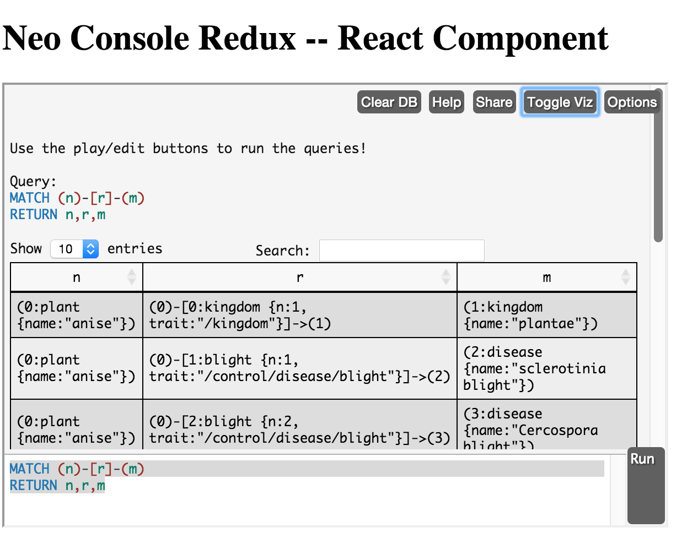

Neo Console Redux
==================

Simplistic example of how a neo console can be embedded in a webpage. The console is captured into a React component. 

Special efforts have been made to avoid any external dependency (other than react) or any reliance on node modules for the build process.

To try, simply open index.html in your browser. 

To embed in the document:

    var rConsole = React.render(React.createElement(
        NeoConsoleReact, 
        { 
            onLoad: runQueries, 
            onData: function(data) { console.log(data); },
            consoleUrl: consoleUrl 
        }
    ), document.getElementById('console'));

And to query:
    
    rConsole.setProps({callId: 1, queries: [queries.createData]});

